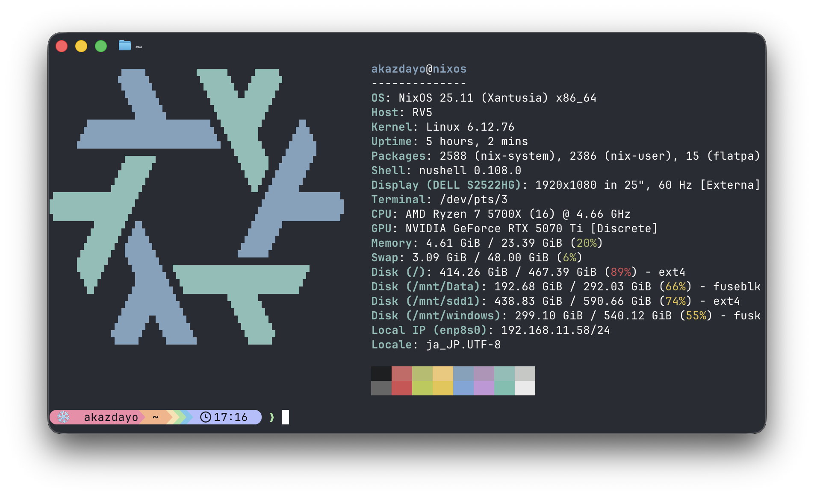

## WiVRnについて
この記事ではWiVRnについては説明しません。以下の記事を参照してください。
https://zenn.dev/akazdayo/articles/de24987d4b11a8

## 環境

Minecraft・MODバージョンは多分関係ない。Launcherはシステムインストール(flatpakではない)のPrism Launcherを使用。

:::message alert
多分Flatpak経由のPrism Launcherだと無理. または面倒くさい。
WiVRnを使用する場合、起動時に引数を渡す必要があるのでFlatpakだと引数まわりとサンドボックスの制約が大変そうかも。
:::

### WiVRnの設定
OpenVRブリッジは、どうやらOpenCompositeでは安定していなさそう。なのでXRizerを使用する必要がありそう。

ソース: 
https://github.com/Vivecraft/VivecraftMod/issues/358
https://github.com/Vivecraft/VivecraftMod/issues/380#issuecomment-2861949795
https://www.reddit.com/r/virtualreality_linux/comments/1lcev5w/error_with_minecraft_vr/

## 起動構成
Prism Launcherを非Steamゲームとして追加して、起動オプションに以下を追加。
```
PRESSURE_VESSEL_IMPORT_OPENXR_1_RUNTIMES=1 %command%
```

この状態でSteamからPrism Launcherを起動し、普通にVivecraftを起動すればOK
